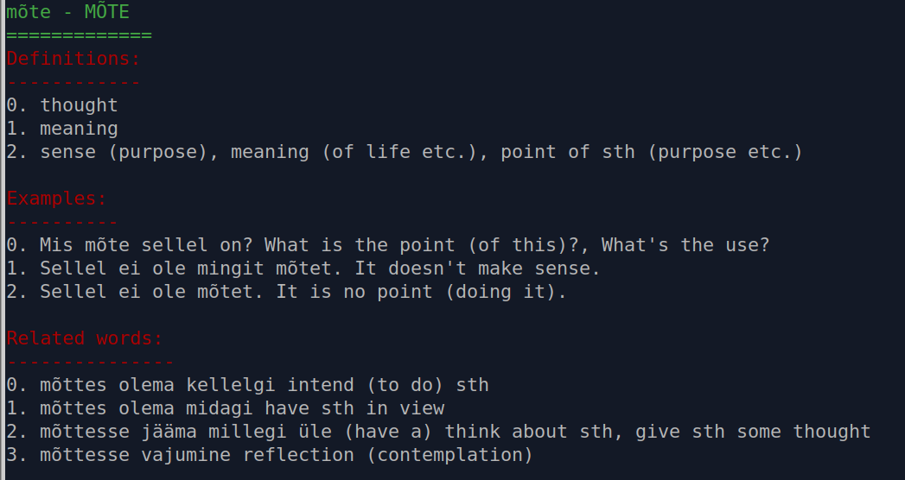
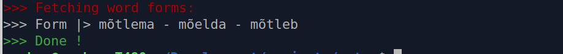

# ESTGO

Some command line tool to scrape and fetch Estonian word data.

## Usage

```shell script
# fetch nominative, genitive and partitive forms of a given word.
./estgo forms <word>

# fetch the forms for all the words in a file, and create an anki
# card as an output.
./estgo forms "filename.txt" -f

# fetch definitions, related words and examples of a given word
./estgo def <word>
```



